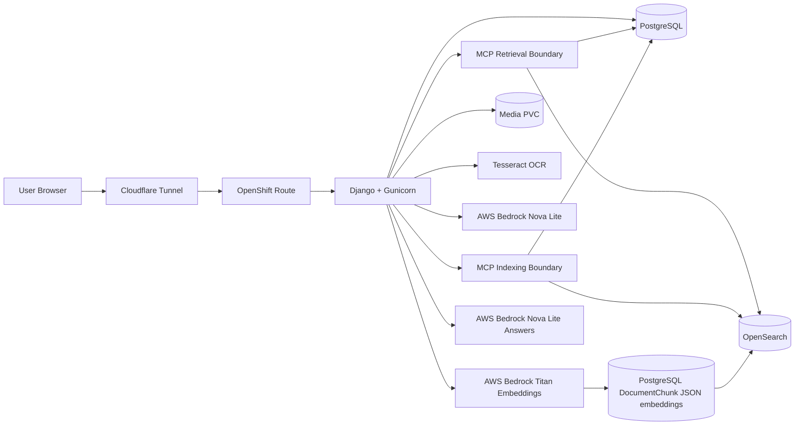

# Intelligent Document Management Platform

A Django-based intelligent document management application deployed on OpenShift CRC with PostgreSQL, OpenSearch, persistent document storage, Okta authentication, OCR, audit logging, AI metadata suggestions, AWS Bedrock embeddings, semantic AI search, and RAG document Q&A.

The public demo path used during development is:

```text
https://docsdemo.khalique.net/
```

OpenShift CRC still exposes the internal route host, while Cloudflare Tunnel provides the public demo hostname.

## Documentation

Detailed architecture and operational documentation:

- [Architecture](docs/architecture.md)
- [Deployment Guide](docs/deployment.md)
- [AI Workflow](docs/ai-workflow.md)
- [MCP Document Retrieval Contract](docs/mcp-retrieval-contract.md)
- [MCP Document Indexing Contract](docs/mcp-indexing-contract.md)

## High-Level Architecture Diagram



## Project Purpose

This project is a learning and architecture build for an enterprise-style document management and intelligent document processing platform. The goal is to grow a simple upload/search application into a practical ECM/IDP-style system using open-source components and production-like deployment patterns.

The platform currently supports document upload, metadata capture, OCR and text extraction, secure viewing, role-based access, audit history, OpenShift deployment, AI-assisted metadata suggestions, document embeddings, semantic AI search, and grounded document question answering.

## Current Feature Set

- Upload PDFs, Word documents, text files, spreadsheets, and supported images.
- Validate uploads by extension, content type, and configured size limit.
- Store uploaded files on OpenShift persistent volume storage.
- Store document metadata, extracted text, and embeddings in PostgreSQL.
- Extract text from PDF, DOCX, TXT, XLSX, and image files.
- Use OCR fallback for scanned PDFs and direct OCR for scanned images.
- Search by document type, subtype, department, author, tags, and extracted text.
- Paginate search results.
- Preview supported image documents inline.
- Open stored documents through authenticated secure views.
- Edit document metadata after upload.
- Delete documents through an admin-only confirmation flow.
- Record upload, metadata edit, and delete actions in an audit table.
- View audit events through an admin-only audit page.
- Authenticate users through Okta OIDC.
- Authorize access through Okta group-based application roles.
- Generate AI metadata suggestions through AWS Bedrock Nova Lite.
- Show field-level confidence, reasons, and source evidence for AI metadata suggestions.
- Auto-generate AI suggestions during upload when extracted text is available.
- Review, accept, reject, or regenerate AI suggestions from the edit metadata page.
- Split extracted text into chunks and store AWS Bedrock Titan embeddings.
- Index upload/reprocess and bulk-import documents through the MCP indexing boundary when enabled.
- Rebuild embeddings in batch with a Django management command.
- Search documents by meaning through the AI Search page.
- Ask document questions with MCP-backed retrieved chunk citations through the Ask Documents page.
- Bulk import local test documents through a Django management command.
- Use synthetic Word, Excel, PDF, and OCR image samples from `test_documents/`.

## Technology Stack

| Layer | Technology |
| --- | --- |
| Frontend | Django templates, server-rendered HTML/CSS |
| Backend | Python, Django |
| App server | Gunicorn |
| Database | PostgreSQL |
| File storage | OpenShift PersistentVolumeClaim |
| OCR | Tesseract, pdf2image, Pillow |
| Document parsing | pypdf, python-docx, openpyxl |
| Authentication | Okta OIDC through Authlib |
| Authorization | Okta groups stored in Django session |
| AI metadata | AWS Bedrock Nova Lite |
| AI embeddings | AWS Bedrock Titan Text Embeddings V2 |
| Search index | OpenSearch document and chunk indexes |
| Semantic search | AWS Bedrock query embeddings with OpenSearch k-NN retrieval |
| MCP indexing | Backend indexing boundary for upload/reprocess and bulk import |
| RAG Q&A | MCP retrieval boundary over OpenSearch chunks with AWS Bedrock Nova Lite answer generation |
| Container platform | OpenShift CRC |
| Container image | Docker Hub image `docker.io/khalique/document-app:2.4-ai-explainability` |
| Public demo access | Cloudflare Tunnel |

## High-Level Architecture

```text
Browser
  -> Cloudflare Tunnel / OpenShift Route
  -> document-app Service
  -> Gunicorn + Django
  -> PostgreSQL Service
  -> Database PVC

Django
  -> document media PVC
  -> OpenSearch Service and OpenSearch PVC
  -> MCP indexing boundary for upload/reprocess and bulk import
  -> MCP retrieval boundary for Ask Documents
  -> AWS Bedrock Nova Lite over HTTPS
  -> AWS Bedrock Titan Embeddings over HTTPS
  -> DocumentChunk rows in PostgreSQL
  -> OpenSearch document and chunk indexes
```

The Django application, PostgreSQL, and OpenSearch run as separate OpenShift deployments. PostgreSQL is the active metadata and system-of-record database with `DB_ENGINE=postgresql`. Semantic and vector retrieval uses OpenSearch, and Ask Documents routes retrieval through the backend MCP boundary before Nova Lite answer generation. PostgreSQL stores canonical document metadata, workflow state, audit events, sessions, file references, chunk text, and JSON embedding data used for reindexing. The current application image supports PostgreSQL only. Uploaded documents live on the media PVC. AWS Bedrock Nova Lite is used for AI metadata suggestions and RAG answers. AWS Bedrock Titan Text Embeddings V2 is used for document and query embeddings.

## Database Backend

The application uses PostgreSQL. `DB_ENGINE` defaults to `postgresql`; other
database engines are not supported by the current application image.

Current PostgreSQL configuration:

```text
DB_ENGINE=postgresql
DB_NAME=document_management
DB_USER=docuser
DB_PASSWORD=<database-password>
DB_HOST=postgresql
DB_PORT=5432
AI_EMBEDDING_DIMENSIONS=1024
```

After changing database settings, restart the app and run migrations:

```powershell
oc rollout restart deployment/document-app
oc rollout status deployment/document-app
oc exec deployment/document-app -- python manage.py migrate
```

## AWS Bedrock Configuration

The current implementation uses AWS Bedrock for AI metadata, embeddings, and
RAG answer generation.

Check the current Bedrock settings in OpenShift:

```powershell
oc exec deployment/document-app -- printenv AI_METADATA_PROVIDER
oc exec deployment/document-app -- printenv AWS_REGION
oc exec deployment/document-app -- printenv BEDROCK_NOVA_MODEL_ID
oc exec deployment/document-app -- printenv BEDROCK_EMBED_MODEL_ID
```

Bedrock uses boto3's normal credential chain. In OpenShift, provide AWS credentials through `secret/docmanager-secrets` or another injected credential mechanism:

```text
AWS_ACCESS_KEY_ID
AWS_SECRET_ACCESS_KEY
AWS_SESSION_TOKEN  # only for temporary credentials
```

Validate Bedrock embeddings from the running app:

```powershell
oc exec deployment/document-app -- python manage.py shell -c "from documents.embeddings import get_titan_embedding; print(len(get_titan_embedding('hello world')))"
```

Expected output is `1024`.

## AI Embeddings and Semantic Search

The application stores semantic embeddings in `DocumentChunk` records and indexes derived chunk vectors in OpenSearch. Each uploaded document's extracted text is split into paragraph-aware chunks, sent to AWS Bedrock Titan Text Embeddings V2, saved in PostgreSQL for rebuild/debug support, and indexed into OpenSearch for AI Search retrieval.

Embeddings are generated automatically after upload when extracted text is available. If embedding generation fails, upload still succeeds and AI metadata suggestions continue.

Rebuild embeddings for existing documents:

```powershell
oc exec deployment/document-app -- python manage.py rebuild_embeddings --limit 5
```

Rebuild OpenSearch indexes from PostgreSQL:

```powershell
oc exec deployment/document-app -- python manage.py reindex_opensearch --create-indexes
```

Check AI Search dependency health:

```powershell
oc exec deployment/document-app -- python manage.py health_ai_search
```

Use `--skip-bedrock` when you only want PostgreSQL and OpenSearch diagnostics
without making a live AWS Bedrock embedding call.

Run the combined document intelligence health check after deployment changes or
credential updates:

```powershell
oc exec deployment/document-app -- python manage.py health_document_intelligence
```

This checks PostgreSQL document/chunk readiness, OpenSearch document and chunk
indexes, Bedrock Titan embeddings, Bedrock Nova answer generation, MCP runtime
flags, and configured request limits. Use `--skip-live` when you want to avoid
live Bedrock calls.

Known-good OpenShift output should end with no errors or warnings:

```text
runtime=ok aws_region=us-east-1 nova_model=amazon.nova-lite-v1:0 embed_model=amazon.titan-embed-text-v2:0 embedding_dimensions=1024 opensearch_url=http://opensearch:9200
aws_credentials=ok access_key_configured=True secret_key_configured=True session_token_configured=False
mcp=ok retrieval_enabled=True retrieval_fallback_enabled=False indexing_enabled=True
limits=ok bedrock_timeout_seconds=90 opensearch_timeout_seconds=10 embedding_max_chars=2500 search_top_k=5 rag_top_k=5 rag_max_context_chars=1800 rag_max_answer_tokens=700 rag_min_context_chars=80
postgres=ok documents=2170 chunks=1333
postgres_embeddings=ok chunks_with_embeddings=1333 dimensions=1024
opensearch=ok version=3.3.0
opensearch_documents=ok index=docmanager-documents count=2170
opensearch_chunks=ok index=docmanager-document-chunks count=1333
bedrock_embedding=ok dimensions=1024
bedrock_answer=ok non_empty=True model=amazon.nova-lite-v1:0
summary=done errors=0 warnings=0
```

The document and chunk counts will vary by environment. The important signals
are `mcp=ok`, matching PostgreSQL/OpenSearch counts for indexed records,
successful Bedrock embedding and answer checks, and `summary=done errors=0`.

Open the AI Search page:

```text
/ai-search/
```

Open the RAG document Q&A page:

```text
/ask/
```

For a learning-focused walkthrough of the RAG call flow, model roles, prompt
construction, and citation handling, see
[`docs/rag-question-answering.md`](docs/rag-question-answering.md).
For learner-friendly upload/indexing, Ask Documents, and semantic search flow
diagrams, see [`docs/ai-workflow.md`](docs/ai-workflow.md).
For the active MCP boundary around the same retrieval path, see
[`docs/mcp-retrieval-contract.md`](docs/mcp-retrieval-contract.md).
For the active MCP boundary around chunking, embedding, and indexing, see
[`docs/mcp-indexing-contract.md`](docs/mcp-indexing-contract.md).

## MCP Retrieval Validation

The OpenShift MCP runtime uses `docker.io/khalique/document-app:2.4-ai-explainability`
with `MCP_RETRIEVAL_ENABLED=True` and `MCP_INDEXING_ENABLED=True`. During
validation, retrieval fallback is disabled so MCP retrieval failures are visible
instead of silently using the direct path.

Verify the running image and flags:

```powershell
oc get deployment document-app -o jsonpath="{.spec.template.spec.containers[0].image}{'\n'}"
oc exec deployment/document-app -- python manage.py shell -c "from django.conf import settings; print(settings.MCP_RETRIEVAL_ENABLED, settings.MCP_RETRIEVAL_FALLBACK_ENABLED)"
```

Run the MCP retrieval health check:

```powershell
oc exec deployment/document-app -- python manage.py health_mcp_retrieval
```

Use `--skip-live` to verify settings without calling Bedrock or OpenSearch.
Use `--json` to print the raw MCP response for a live smoke test.

You can also call the MCP tool wrapper directly:

```powershell
oc exec deployment/document-app -- python manage.py shell -c "from documents.mcp_retrieval import search_documents; import json; result=search_documents({'query':'When does health coverage start?','user_context':{'roles':['viewer']},'options':{'max_results':3},'trace':{'request_id':'manual-mcp-smoke'}}); print(json.dumps(result, indent=2, default=str))"
```

If the response is `permission_context_missing`, include a viewer/loader/admin
role or group in `user_context`. If it is `retrieval_unavailable`, check
OpenSearch and rebuild indexes. If it is `embedding_provider_error`, check AWS
Bedrock credentials, model access, and region.

Example semantic queries:

```text
employee onboarding
vendor invoice
security access request
privacy impact
expense reimbursement
```

Example document questions:

```text
What are the onboarding requirements?
Which documents mention vendor invoices?
What privacy risks are described?
```

## Bulk Test Document Import

The repository includes synthetic test documents under `test_documents/`:

```text
test_documents/word/
test_documents/excel/
test_documents/pdf/
test_documents/ocr_images/
test_documents/rag_health_policy/
```

These files are generated for upload, OCR, metadata, embedding, AI Search, and
RAG document Q&A testing.

For a brand new deployment, first confirm the deployed app has Bedrock,
OpenSearch, and MCP indexing enabled:

```powershell
oc exec deployment/document-app -c document-app -- printenv AWS_REGION
oc exec deployment/document-app -c document-app -- printenv BEDROCK_EMBED_MODEL_ID
oc exec deployment/document-app -c document-app -- printenv MCP_INDEXING_ENABLED
oc exec deployment/document-app -c document-app -- python manage.py shell -c "from documents.embeddings import get_titan_embedding; print(len(get_titan_embedding('hello world')))"
```

Expected:

```text
us-east-1
amazon.titan-embed-text-v2:0
True
1024
```

Copy a test bundle into the running OpenShift pod:

```powershell
oc get pods -l app=document-app
$pod = oc get pod -l app=document-app -o jsonpath="{.items[0].metadata.name}"
oc cp .\test_documents\pdf $pod`:/tmp/bulk-docs -c document-app
oc exec $pod -c document-app -- ls -la /tmp/bulk-docs
```

Import a small batch first and prepare AI Search:

```powershell
oc exec $pod -c document-app -- python manage.py bulk_import_documents /tmp/bulk-docs --limit 5 --rebuild-embeddings --reindex-opensearch --create-indexes 2>&1 | Select-String "mcp_indexing|chunks embedded|chunks indexed|Done"
```

When `MCP_INDEXING_ENABLED=True`, the bulk import command uses the MCP indexing
boundary. Expected proof:

```text
mcp_indexing status=ok code=success ... chunks_created=1 chunk_records_indexed=1
Document ... imported; 1 chunks embedded; 1 chunks indexed
Done. processed=5 imported=5 embedded=5 indexed=5 failed=0
```

Confirm database counts:

```powershell
oc exec $pod -c document-app -- python manage.py shell -c "from documents.models import Document, DocumentChunk; print('documents', Document.objects.count()); print('chunks', DocumentChunk.objects.count())"
```

Import the focused RAG test bundle:

```powershell
oc cp .\test_documents\rag_health_policy $pod`:/tmp/rag-health-policy -c document-app
oc exec $pod -c document-app -- python manage.py bulk_import_documents /tmp/rag-health-policy --rebuild-embeddings --reindex-opensearch --create-indexes 2>&1 | Select-String "mcp_indexing|chunks embedded|chunks indexed|Done"
```

Validate from the browser:

```text
1. Search page finds imported documents by filename, metadata, or content.
2. AI Search returns semantically relevant imported documents.
3. Ask Documents returns an answer with citations.
4. Citation links open the source documents.
```

Confirm Ask Documents used MCP retrieval:

```powershell
oc logs deployment/document-app -c document-app --tail=300 | Select-String "mcp_retrieval|rag_mcp"
```

Expected proof:

```text
mcp_retrieval status=ok code=success ... returned_count=...
rag_mcp status=ok ... results=...
```

Run lightweight tests inside OpenShift:

```powershell
oc exec deployment/document-app -- python manage.py test documents
```

## Role Model

| Role | Okta Group | Capability |
| --- | --- | --- |
| Viewer | `DjangoViewer` | Search and view documents |
| Loader | `DjangoLoader` | Viewer permissions plus upload, scanned OCR, edit metadata, AI suggestion review |
| Admin | `DjangoAdmin` | Loader permissions plus delete access and audit log access |

Access is enforced with view decorators in `documents/permissions.py`. Group values are read from Okta claims during login and stored in the Django session.

## Development Phases

### Phase 1: Core Document Management

The first phase established the basic Django document management application.

Implemented:

- `Document` model for metadata and file storage.
- Upload form for supported document types.
- Search page with metadata filters.
- Secure document view endpoint.
- Edit metadata page.
- Basic templates and navigation.
- Local media storage that later mapped cleanly to OpenShift PVC storage.

Implementation method:

- Kept the application server-rendered with Django templates for simplicity.
- Used Django `ModelForm` classes for upload and edit flows.
- Stored uploaded files with Django `FileField`.
- Used metadata fields that are simple to search with database filters.

## Author

Khalique AWS
