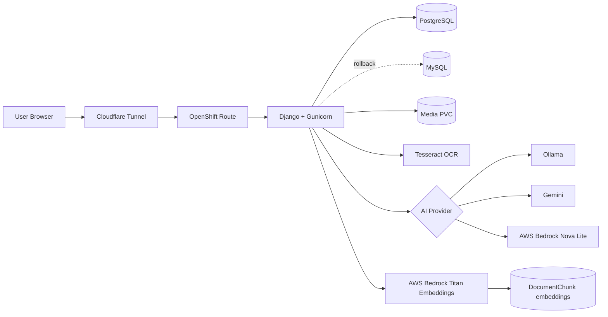

# Intelligent Document Management Platform

A Django-based intelligent document management application deployed on OpenShift CRC with MySQL or PostgreSQL, persistent document storage, Okta authentication, OCR, audit logging, AI metadata suggestions, AWS Bedrock embeddings, and semantic AI search.

The public demo path used during development is:

```text
https://docsdemo.khalique.net/
```

OpenShift CRC still exposes the internal route host, while Cloudflare Tunnel provides the public demo hostname.

## Documentation

Detailed architecture and operational documentation:

- [Architecture](docs/architecture.md)
- [Deployment Guide](docs/deployment.md)
- [AI Workflow](docs/ai-workflow.md)

## High-Level Architecture Diagram



## Project Purpose

This project is a learning and architecture build for an enterprise-style document management and intelligent document processing platform. The goal is to grow a simple upload/search application into a practical ECM/IDP-style system using open-source components and production-like deployment patterns.

The platform currently supports document upload, metadata capture, OCR and text extraction, secure viewing, role-based access, audit history, OpenShift deployment, AI-assisted metadata suggestions, document embeddings, and semantic AI search.

## Current Feature Set

- Upload PDFs, Word documents, text files, spreadsheets, and supported images.
- Validate uploads by extension, content type, and configured size limit.
- Store uploaded files on OpenShift persistent volume storage.
- Store document metadata, extracted text, and embeddings in PostgreSQL.
- Extract text from PDF, DOCX, TXT, XLSX, and image files.
- Use OCR fallback for scanned PDFs and direct OCR for scanned images.
- Search by document type, subtype, department, author, tags, and extracted text.
- Paginate search results.
- Preview supported image documents inline.
- Open stored documents through authenticated secure views.
- Edit document metadata after upload.
- Delete documents through an admin-only confirmation flow.
- Record upload, metadata edit, and delete actions in an audit table.
- View audit events through an admin-only audit page.
- Authenticate users through Okta OIDC.
- Authorize access through Okta group-based application roles.
- Generate AI metadata suggestions through Ollama, Gemini, or AWS Bedrock Nova Lite.
- Auto-generate AI suggestions during upload when extracted text is available.
- Review, accept, reject, or regenerate AI suggestions from the edit metadata page.
- Split extracted text into chunks and store AWS Bedrock Titan embeddings.
- Rebuild embeddings in batch with a Django management command.
- Search documents by meaning through the AI Search page.
- Bulk import local test documents through a Django management command.
- Use synthetic Word, Excel, PDF, and OCR image samples from `test_documents/`.

## Technology Stack

| Layer | Technology |
| --- | --- |
| Frontend | Django templates, server-rendered HTML/CSS |
| Backend | Python, Django |
| App server | Gunicorn |
| Database | PostgreSQL active, MySQL retained as optional fallback |
| File storage | OpenShift PersistentVolumeClaim |
| OCR | Tesseract, pdf2image, Pillow |
| Document parsing | pypdf, python-docx, openpyxl |
| Authentication | Okta OIDC through Authlib |
| Authorization | Okta groups stored in Django session |
| AI metadata | Switchable Ollama, Gemini, or AWS Bedrock provider |
| AI embeddings | AWS Bedrock Titan Text Embeddings V2 |
| Semantic search | JSON embeddings with cosine similarity |
| Container platform | OpenShift CRC |
| Container image | Docker build through OpenShift binary build |
| Public demo access | Cloudflare Tunnel |

## High-Level Architecture

```text
Browser
  -> Cloudflare Tunnel / OpenShift Route
  -> document-app Service
  -> Gunicorn + Django
  -> PostgreSQL Service
  -> Database PVC

Django
  -> document media PVC
  -> Ollama Service and Ollama model PVC
  -> Gemini API over HTTPS
  -> AWS Bedrock Nova Lite over HTTPS
  -> AWS Bedrock Titan Embeddings over HTTPS
  -> DocumentChunk rows in PostgreSQL
```

The Django application and database run as separate OpenShift deployments. PostgreSQL with pgvector is the active database with `DB_ENGINE=postgresql`. Semantic vector search depends on PostgreSQL pgvector, and the application image no longer includes MySQL runtime support. Uploaded documents live on the media PVC. Ollama remains available as a local/private provider and serves the local model over the internal OpenShift service name `http://ollama:11434`. Gemini and AWS Bedrock Nova Lite are external metadata provider options. AWS Bedrock Titan Text Embeddings V2 is used for semantic search embeddings.

## Database Backend

The application uses PostgreSQL. `DB_ENGINE` defaults to `postgresql`; other
database engines are not supported by the current application image.

Current PostgreSQL configuration:

```text
DB_ENGINE=postgresql
DB_NAME=document_management
DB_USER=docuser
DB_PASSWORD=<database-password>
DB_HOST=postgresql
DB_PORT=5432
AI_EMBEDDING_DIMENSIONS=1024
```

After changing database settings, restart the app and run migrations:

```powershell
oc rollout restart deployment/document-app
oc rollout status deployment/document-app
oc exec deployment/document-app -- python manage.py migrate
```

## Switching AI Metadata Providers

The active AI metadata provider is controlled by `AI_METADATA_PROVIDER`. Supported values are:

```text
ollama
gemini
bedrock
```

For PowerShell, use `oc set env` on the deployment. This is the quickest live switch and avoids JSON patch quoting issues.

Check the current provider in OpenShift:

```powershell
oc exec deployment/document-app -- printenv AI_METADATA_PROVIDER
```

Switch to Ollama:

```powershell
oc set env deployment/document-app AI_METADATA_PROVIDER=ollama
```

Switch to Gemini:

```powershell
oc set env deployment/document-app AI_METADATA_PROVIDER=gemini
```

Gemini also requires `GEMINI_API_KEY` in `secret/docmanager-secrets`.

Switch to AWS Bedrock Nova Lite:

```powershell
oc set env deployment/document-app AI_METADATA_PROVIDER=bedrock
```

Set model-specific values only when changing them from the configured defaults:

```powershell
oc set env deployment/document-app `
  OLLAMA_BASE_URL=http://ollama:11434 `
  OLLAMA_MODEL=qwen2.5:0.5b `
  GEMINI_MODEL=gemini-2.5-flash `
  AWS_REGION=us-east-1 `
  BEDROCK_NOVA_MODEL_ID=amazon.nova-lite-v1:0 `
  BEDROCK_EMBED_MODEL_ID=amazon.titan-embed-text-v2:0 `
  AI_EMBEDDING_MAX_CHARS=2500 `
  AI_SEARCH_TOP_K=5
```

Bedrock uses boto3's normal credential chain. In OpenShift, provide AWS credentials through `secret/docmanager-secrets` or another injected credential mechanism:

```text
AWS_ACCESS_KEY_ID
AWS_SECRET_ACCESS_KEY
AWS_SESSION_TOKEN  # only for temporary credentials
```

After switching providers, wait for the rollout and verify Django starts:

```powershell
oc rollout status deployment/document-app
oc exec deployment/document-app -- python manage.py check
```

Then regenerate AI metadata on a document from the edit metadata page. The AI Suggested Metadata panel shows which provider produced the suggestion.

## AI Embeddings and Semantic Search

The application stores semantic embeddings in `DocumentChunk` records. Each uploaded document's extracted text is split into paragraph-aware chunks, sent to AWS Bedrock Titan Text Embeddings V2, and saved as JSON vectors in the active database.

Embeddings are generated automatically after upload when extracted text is available. If embedding generation fails, upload still succeeds and AI metadata suggestions continue.

Rebuild embeddings for existing documents:

```powershell
oc exec deployment/document-app -- python manage.py rebuild_embeddings --limit 5
```

Open the AI Search page:

```text
/ai-search/
```

Example semantic queries:

```text
employee onboarding
vendor invoice
security access request
privacy impact
expense reimbursement
```

## Bulk Test Document Import

The repository includes synthetic test documents under `test_documents/`:

```text
test_documents/word/
test_documents/excel/
test_documents/pdf/
test_documents/ocr_images/
```

These files are generated for upload, OCR, metadata, embedding, and AI Search testing.

Copy them into the running OpenShift pod:

```powershell
oc get pods -l app=document-app
oc cp test_documents <document-app-pod>:/tmp/test_documents
```

Import a batch:

```powershell
oc exec deployment/document-app -- python manage.py bulk_import_documents /tmp/test_documents --limit 20
```

Then create embeddings:

```powershell
oc exec deployment/document-app -- python manage.py rebuild_embeddings
```

Run lightweight tests inside OpenShift:

```powershell
oc exec deployment/document-app -- python manage.py test documents
```

## Role Model

| Role | Okta Group | Capability |
| --- | --- | --- |
| Viewer | `DjangoViewer` | Search and view documents |
| Loader | `DjangoLoader` | Viewer permissions plus upload, scanned OCR, edit metadata, AI suggestion review |
| Admin | `DjangoAdmin` | Loader permissions plus delete access and audit log access |

Access is enforced with view decorators in `documents/permissions.py`. Group values are read from Okta claims during login and stored in the Django session.

## Development Phases

### Phase 1: Core Document Management

The first phase established the basic Django document management application.

Implemented:

- `Document` model for metadata and file storage.
- Upload form for supported document types.
- Search page with metadata filters.
- Secure document view endpoint.
- Edit metadata page.
- Basic templates and navigation.
- Local media storage that later mapped cleanly to OpenShift PVC storage.

Implementation method:

- Kept the application server-rendered with Django templates for simplicity.
- Used Django `ModelForm` classes for upload and edit flows.
- Stored uploaded files with Django `FileField`.
- Used metadata fields that are simple to search with database filters.

## Author

Khalique AWS
