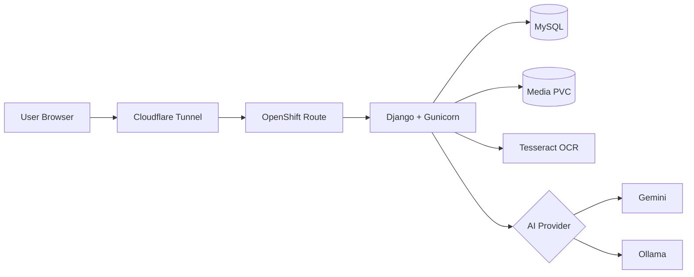

# Intelligent Document Management Platform

A Django-based intelligent document management application deployed on OpenShift CRC with MySQL, persistent document storage, Okta authentication, OCR, audit logging, and AI metadata suggestions through a switchable Gemini or Ollama provider.

The public demo path used during development is:

```text
https://docsdemo.khalique.net/
```

OpenShift CRC still exposes the internal route host, while Cloudflare Tunnel provides the public demo hostname.

## Documentation

Detailed architecture and operational documentation:

- [Architecture](docs/architecture.md)
- [Deployment Guide](docs/deployment.md)
- [AI Workflow](docs/ai-workflow.md)

## High-Level Architecture Diagram



## Project Purpose

This project is a learning and architecture build for an enterprise-style document management and intelligent document processing platform. The goal is to grow a simple upload/search application into a practical ECM/IDP-style system using open-source components and production-like deployment patterns.

The platform currently supports document upload, metadata capture, OCR and text extraction, secure viewing, role-based access, audit history, OpenShift deployment, and AI-assisted metadata suggestions.

## Current Feature Set

- Upload PDFs, Word documents, text files, spreadsheets, and supported images.
- Validate uploads by extension, content type, and configured size limit.
- Store uploaded files on OpenShift persistent volume storage.
- Store document metadata and extracted text in MySQL.
- Extract text from PDF, DOCX, TXT, XLSX, and image files.
- Use OCR fallback for scanned PDFs and direct OCR for scanned images.
- Search by document type, subtype, department, author, tags, and extracted text.
- Paginate search results.
- Preview supported image documents inline.
- Open stored documents through authenticated secure views.
- Edit document metadata after upload.
- Delete documents through an admin-only confirmation flow.
- Record upload, metadata edit, and delete actions in an audit table.
- View audit events through an admin-only audit page.
- Authenticate users through Okta OIDC.
- Authorize access through Okta group-based application roles.
- Generate AI metadata suggestions through Ollama or Gemini.
- Auto-generate AI suggestions during upload when extracted text is available.
- Review, accept, reject, or regenerate AI suggestions from the edit metadata page.

## Technology Stack

| Layer | Technology |
| --- | --- |
| Frontend | Django templates, server-rendered HTML/CSS |
| Backend | Python, Django |
| App server | Gunicorn |
| Database | MySQL |
| File storage | OpenShift PersistentVolumeClaim |
| OCR | Tesseract, pdf2image, Pillow |
| Document parsing | pypdf, python-docx, openpyxl |
| Authentication | Okta OIDC through Authlib |
| Authorization | Okta groups stored in Django session |
| AI metadata | Switchable Ollama or Gemini provider |
| Container platform | OpenShift CRC |
| Container image | Docker build through OpenShift binary build |
| Public demo access | Cloudflare Tunnel |

## High-Level Architecture

```text
Browser
  -> Cloudflare Tunnel / OpenShift Route
  -> document-app Service
  -> Gunicorn + Django
  -> MySQL Service
  -> MySQL PVC

Django
  -> document media PVC
  -> Gemini API over HTTPS
  -> or Ollama Service and Ollama model PVC
```

The Django application and MySQL run as separate OpenShift deployments. Uploaded documents live on the media PVC. Gemini is the preferred external provider for higher-quality metadata suggestions. Ollama remains available as a local/private fallback and serves the local model over the internal OpenShift service name `http://ollama:11434`.

## Role Model

| Role | Okta Group | Capability |
| --- | --- | --- |
| Viewer | `DjangoViewer` | Search and view documents |
| Loader | `DjangoLoader` | Viewer permissions plus upload, scanned OCR, edit metadata, AI suggestion review |
| Admin | `DjangoAdmin` | Loader permissions plus delete access and audit log access |

Access is enforced with view decorators in `documents/permissions.py`. Group values are read from Okta claims during login and stored in the Django session.

## Development Phases

### Phase 1: Core Document Management

The first phase established the basic Django document management application.

Implemented:

- `Document` model for metadata and file storage.
- Upload form for supported document types.
- Search page with metadata filters.
- Secure document view endpoint.
- Edit metadata page.
- Basic templates and navigation.
- Local media storage that later mapped cleanly to OpenShift PVC storage.

Implementation method:

- Kept the application server-rendered with Django templates for simplicity.
- Used Django `ModelForm` classes for upload and edit flows.
- Stored uploaded files with Django `FileField`.
- Used metadata fields that are simple to search with database filters.

## Author

Khalique AWS
