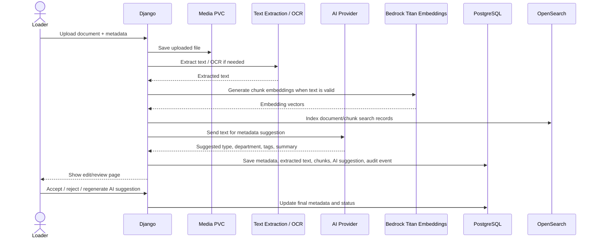
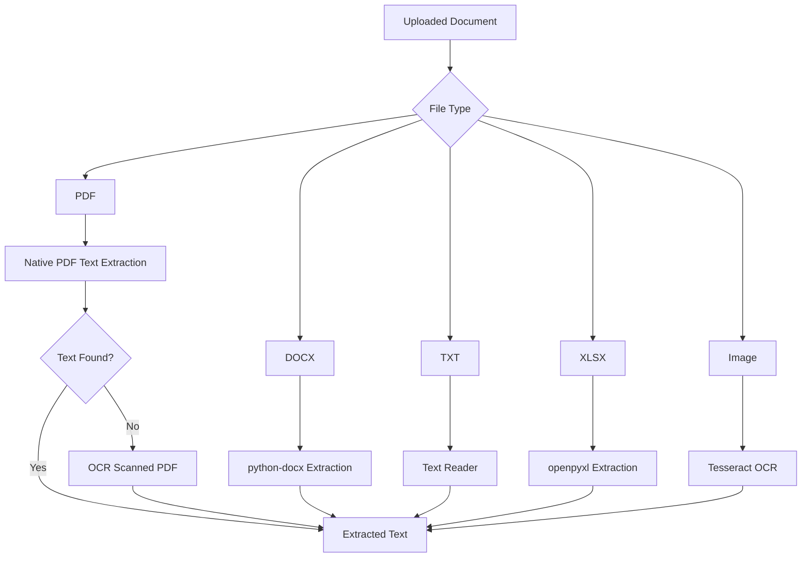
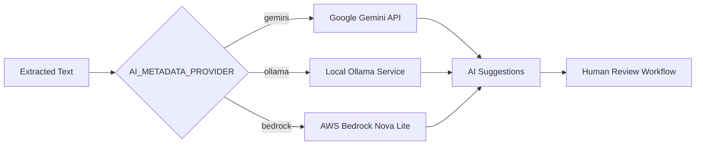
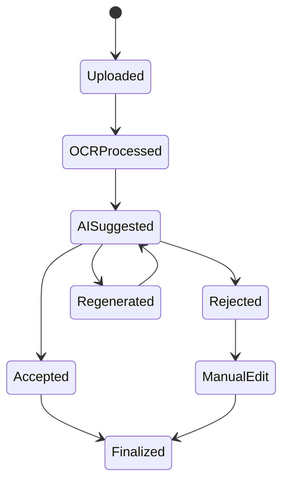
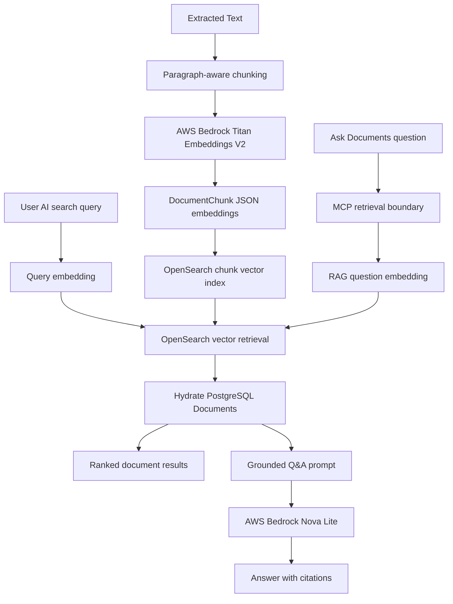

# AI Metadata Workflow

This document describes the OCR and AI-assisted metadata workflow used by the Intelligent Document Management Platform.

The platform combines OCR, document parsing, and AI-assisted metadata generation to help users organize and classify uploaded documents.

## AI Metadata Processing Flow



## OCR Processing Architecture



## AI Provider Selection



## AI Suggestion Lifecycle



## AI Metadata Fields

The application stores AI-generated metadata separately from official metadata.

| Field | Purpose |
| --- | --- |
| ai_document_type | Suggested document classification |
| ai_department | Suggested business department |
| ai_tags | Suggested tags |
| ai_summary | AI-generated document summary |
| ai_metadata_provider | Provider that generated the suggestion |
| ai_suggestion_status | Tracks review state |
| ai_suggested_at | Timestamp of generation |
| ai_error | Error information if generation fails |

## Human Review Design

The platform intentionally requires human review before AI metadata becomes official metadata.

Benefits:

- Prevents incorrect classification.
- Keeps users in control.
- Improves metadata quality.
- Supports auditability.
- Allows safe experimentation with local and external AI providers.

## AI Provider Options

| Provider | Advantage | Tradeoff |
| --- | --- | --- |
| Gemini | Better metadata quality and reasoning | Sends data externally |
| AWS Bedrock Nova Lite | AWS-managed model access through boto3 | Requires AWS credentials, permissions, and model access |
| Ollama | Local/private inference | Limited by local CPU and memory |

## AWS Bedrock Phase 3

Bedrock Phase 3 supports two AI capabilities:

- Metadata suggestions through AWS Bedrock Nova Lite.
- Semantic search embeddings through AWS Bedrock Titan Text Embeddings V2.

Required environment variables:

| Variable | Recommended value | Purpose |
| --- | --- | --- |
| AI_METADATA_PROVIDER | bedrock | Selects Bedrock Nova Lite for metadata suggestions. |
| AWS_REGION | us-east-1 | Region used by boto3 Bedrock runtime clients. |
| BEDROCK_NOVA_MODEL_ID | amazon.nova-lite-v1:0 | Model used for metadata extraction. |
| BEDROCK_EMBED_MODEL_ID | amazon.titan-embed-text-v2:0 | Model used for document chunk embeddings. |
| AI_EMBEDDING_MAX_CHARS | 2500 | Maximum source text per embedding chunk. |
| AI_SEARCH_TOP_K | 5 | Number of AI search results to show. |

Credentials are intentionally not configured in Django settings. boto3 should
use the standard AWS credential chain, such as AWS environment variables,
OpenShift secrets, or EC2 instance profiles.

Minimum AWS permissions:

```text
bedrock:InvokeModel
bedrock:Converse if Converse API calls are used
```

PowerShell validation:

```powershell
aws sts get-caller-identity
aws bedrock list-foundation-models --region us-east-1
```

Application validation:

```powershell
python manage.py rebuild_embeddings --limit 5
```

For OpenShift:

```powershell
oc exec deployment/document-app -- python manage.py rebuild_embeddings --limit 5
```

Successful output shows each document id, file name, and number of chunks
created. If one document fails, the command prints the error and continues.

## Embedding and Semantic Search Flow



Document chunks are stored in the database with their source text, embedding
model, and JSON embedding vector. OpenSearch stores the derived searchable
chunk records. AI Search embeds the user's query, retrieves matching chunks from
OpenSearch, hydrates final document records from PostgreSQL, and returns ranked
document results through the Django UI.

The Ask Documents page uses the same retrieved and hydrated chunks as grounded
context for document question answering. Django routes retrieval through the
MCP `search_documents` boundary, AWS Bedrock Titan creates query embeddings,
OpenSearch retrieves matching chunks, and AWS Bedrock Nova Lite generates the
answer after MCP returns structured context. Answers include citations that link
back to source `Document` records. Retrieved chunks are hydrated through the
current request's accessible PostgreSQL `Document` queryset before they are
included in the prompt. Empty or low-context retrieval returns a clear
no-context answer instead of asking the model to guess.

## Planned MCP Indexing Boundary

The next MCP expansion is write-time indexing. It is documented in
[`mcp-indexing-contract.md`](mcp-indexing-contract.md) and is intentionally
separate from the working retrieval path.

```text
document text
  -> MCP index_document
  -> paragraph-aware chunks
  -> Bedrock Titan embeddings
  -> PostgreSQL DocumentChunk rows
  -> OpenSearch document and chunk records
```

Phase 1 only defines the contract. The current upload, bulk import,
`rebuild_embeddings`, and `reindex_opensearch` flows stay unchanged until an
in-process MCP indexing wrapper is implemented and validated.

## Current AI Design Decisions

- Gemini is preferred when external API usage is acceptable.
- AWS Bedrock Nova Lite is available when AWS-managed inference is preferred.
- AWS Bedrock Titan Embeddings V2 powers semantic AI search when embeddings are available.
- RAG document Q&A uses the MCP retrieval boundary, retrieves OpenSearch chunks, hydrates them through the current user's accessible PostgreSQL documents, refuses low-context questions, then uses AWS Bedrock Nova Lite only after that boundary.
- MCP indexing is planned as a separate write-time boundary; it should reuse the existing chunking, embedding, and OpenSearch indexing behavior before changing runtime upload/import flows.
- Ollama provides a local/private fallback.
- qwen2.5:0.5b is currently used because it fits within CRC resource constraints.
- AI suggestions are generated during upload when extracted text is available.
- AI suggestions remain separate from official metadata until accepted.
- Embedding failures do not block document upload or metadata suggestions.

## Future AI Enhancements

Planned future enhancements include:

- Background AI processing queues.
- Semantic search refinements.
- OpenSearch-backed semantic and hybrid retrieval refinements.
- Metadata confidence scoring.
- Duplicate document detection.
- AI-assisted workflow approvals.
- Document summarization.
- Entity extraction.
- Multilingual OCR enhancement.
