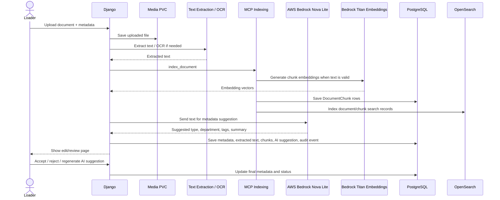
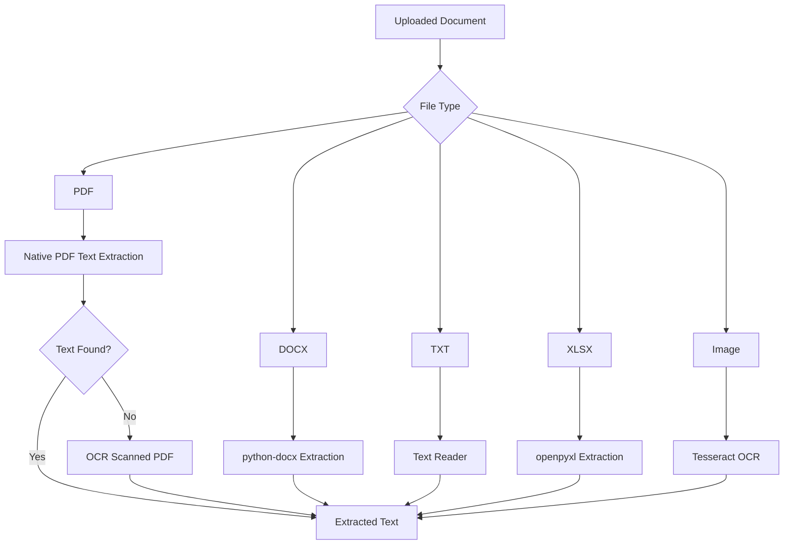
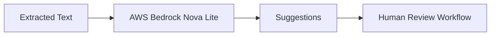
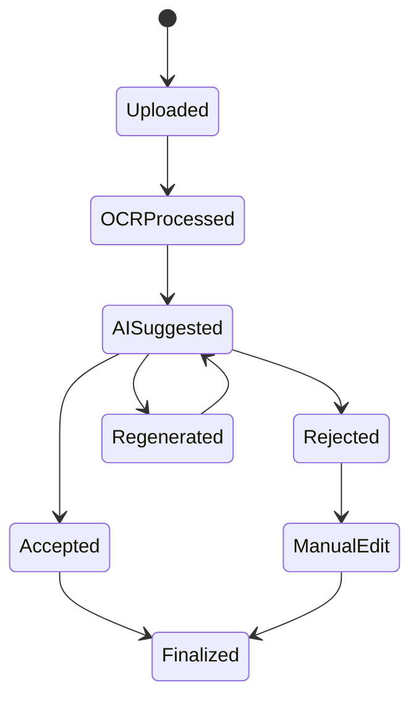
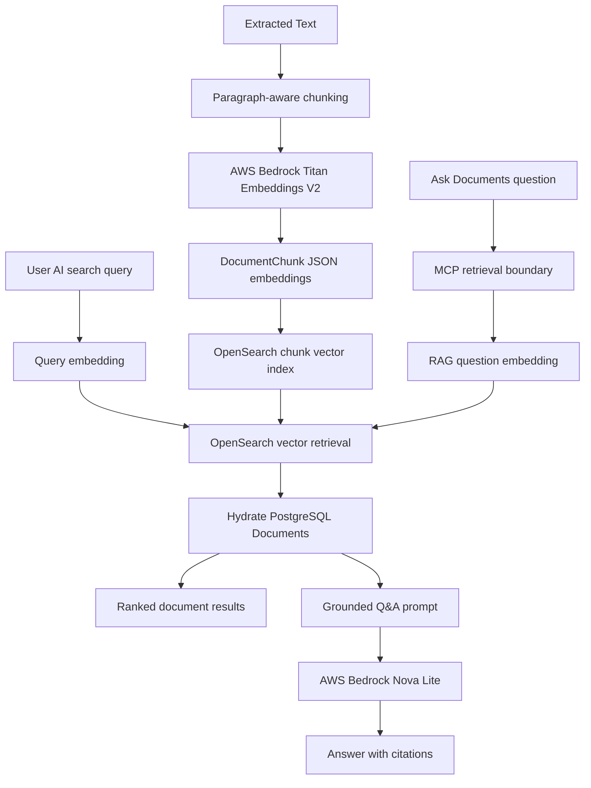

# AI And MCP Workflow

This document describes the OCR, AI-assisted metadata, MCP indexing, semantic search, and RAG workflow used by the Intelligent Document Management Platform.

The current validated implementation uses AWS Bedrock for AI metadata, embeddings, and answer generation. PostgreSQL stores canonical document metadata and chunk records, while OpenSearch stores derived document and vector indexes used by search, AI Search, and Ask Documents.

## AI Metadata Processing Flow



## OCR Processing Architecture



## Bedrock Metadata Provider



## AI Suggestion Lifecycle



## AI Metadata Fields

The application stores AI-generated metadata separately from official metadata.

| Field | Purpose |
| --- | --- |
| ai_document_type | Suggested document classification |
| ai_department | Suggested business department |
| ai_tags | Suggested tags |
| ai_summary | AI-generated document summary |
| ai_metadata_provider | Provider that generated the suggestion |
| ai_suggestion_status | Tracks review state |
| ai_suggested_at | Timestamp of generation |
| ai_error | Error information if generation fails |
| ai_explanation | Field-level confidence, reason, and source evidence stored as JSON |

## AI Metadata Confidence And Explainability

Bedrock metadata responses include a qualitative confidence indicator, a short
reason, and a supporting document excerpt for document type, department, tags,
and summary.

```text
Suggested Value
     |
     +--> High / Medium / Low confidence
     |
     +--> Short reason
     |
     +--> Matching source excerpt
     |
     v
Human Accepts, Edits, Or Rejects
```

Confidence is a review indicator, not a guaranteed probability. The
application accepts only `high`, `medium`, or `low`; unsupported values are not
displayed. Supporting evidence is displayed only when it can be matched back to
the extracted document text after whitespace normalization. Unmatched evidence
is removed and the field is downgraded to low confidence.

Explainability remains separate from official metadata. Accept and reject
actions retain the reviewed AI suggestion and explanation in the audit event.

### Validated OpenShift Flow

The feature was validated with
`docker.io/khalique/document-app:2.4-ai-explainability`.

Validation confirmed:

- migration `0012_document_ai_explanation` applied successfully
- Regenerate produced confidence, reason, and matching evidence
- Accept copied suggestions into official metadata
- Reject retained the reviewed suggestion in audit context
- the existing upload and metadata review workflow remained functional

Existing suggestions created before migration `0012` may not include
explanations. Use Regenerate to create the structured explainability response.

## AI Metadata Quality Review

The Metadata Quality dashboard reviews existing official metadata, including
metadata entered manually or accepted from an earlier AI suggestion.

```text
Loader Selects A Document
     |
     v
Current Metadata + Extracted Text
     |
     v
Bedrock Nova Lite Quality Review
     |
     +--> Quality score
     |
     +--> Semantic mismatch findings
     |
     +--> Recommended values
     |
     +--> Reasons and source evidence
     |
     v
Store MetadataQualityReview In PostgreSQL
     |
     v
Human Reviews And Edits Official Metadata
```

This differs from upload-time metadata suggestion:

- Metadata suggestion asks what metadata a document should have.
- Metadata quality review asks whether the current metadata accurately
  represents the document.

Bedrock performs the semantic judgment. Django validates the response shape,
score range, supported fields, severity values, and source evidence. Reviews
are stored and reused by the dashboard; opening the dashboard does not make a
Bedrock call. Official metadata is never changed automatically. When official
metadata changes, the stored quality review is removed so an outdated score is
not presented as current.

Quality levels are normalized from the AI score for consistent presentation:

| Score | Level |
| --- | --- |
| 90-100 | Excellent |
| 75-89 | Good |
| 50-74 | Needs review |
| 0-49 | Critical |

The first demo implementation supports explicit per-document Review and Review
Again actions plus selecting up to three documents for one synchronous review
batch. The limit keeps the request within the OpenShift web timeout while
background workers remain deferred. Scheduled scans and automatic remediation
remain out of scope.

## Human Review Design

The platform intentionally requires human review before AI metadata becomes official metadata.

Benefits:

- Prevents incorrect classification.
- Keeps users in control.
- Improves metadata quality.
- Supports auditability.
- Allows safe review of Bedrock-generated suggestions before metadata becomes official.

## Learner Flow Diagrams

### Document Upload And MCP Indexing

```text
User Uploads Document
     |
     v
Django Upload View
     |
     v
Save File To Media PVC
     |
     v
Extract Text / OCR
     |
     v
Save Canonical Document Metadata In PostgreSQL
     |
     v
MCP Indexing: index_document
     |
     +--> Split text into paragraph-aware chunks
     |
     +--> Bedrock Titan: embed each chunk
     |
     +--> PostgreSQL: save DocumentChunk rows
     |
     +--> OpenSearch: index document and chunk vectors
     |
     v
Document Ready For Search, AI Search, And Ask
```

### Ask Documents / RAG

```text
User Question
     |
     v
Django /ask/
     |
     v
RAG Workflow
     |
     v
MCP Retrieval
     |
     +--> Bedrock Titan: embed question
     |
     +--> OpenSearch: find similar chunks
     |
     +--> PostgreSQL: confirm source documents
     |
     v
Retrieved Evidence + Citations
     |
     v
RAG Prompt
     |
     v
Bedrock Nova Lite
     |
     v
Answer With Citations
```

### Semantic AI Search

```text
User Search Query
     |
     v
Django /ai-search/
     |
     v
Bedrock Titan: embed query
     |
     v
OpenSearch: find similar indexed chunks
     |
     v
PostgreSQL: hydrate matching documents
     |
     v
Ranked Semantic Search Results
```

## AWS Bedrock Runtime

Bedrock supports three AI capabilities in the current deployment:

- Metadata suggestions through AWS Bedrock Nova Lite.
- Document and query embeddings through AWS Bedrock Titan Text Embeddings V2.
- Ask Documents answer generation through AWS Bedrock Nova Lite after MCP retrieval.

Required environment variables:

| Variable | Recommended value | Purpose |
| --- | --- | --- |
| AI_METADATA_PROVIDER | bedrock | Selects Bedrock Nova Lite for metadata suggestions. |
| AWS_REGION | us-east-1 | Region used by boto3 Bedrock runtime clients. |
| BEDROCK_NOVA_MODEL_ID | amazon.nova-lite-v1:0 | Model used for metadata extraction. |
| BEDROCK_EMBED_MODEL_ID | amazon.titan-embed-text-v2:0 | Model used for document chunk embeddings. |
| AI_EMBEDDING_MAX_CHARS | 2500 | Maximum source text per embedding chunk. |
| AI_SEARCH_TOP_K | 5 | Number of AI search results to show. |

Credentials are intentionally not configured in Django settings. boto3 should
use the standard AWS credential chain, such as AWS environment variables,
OpenShift secrets, or EC2 instance profiles.

Minimum AWS permissions:

```text
bedrock:InvokeModel
bedrock:Converse if Converse API calls are used
```

PowerShell validation:

```powershell
aws sts get-caller-identity
aws bedrock list-foundation-models --region us-east-1
```

Application validation:

```powershell
python manage.py rebuild_embeddings --limit 5
```

For OpenShift:

```powershell
oc exec deployment/document-app -- python manage.py rebuild_embeddings --limit 5
```

Successful output shows each document id, file name, and number of chunks
created. If one document fails, the command prints the error and continues.

## Embedding and Semantic Search Flow



Document chunks are stored in the database with their source text, embedding
model, and JSON embedding vector. OpenSearch stores the derived searchable
chunk records. AI Search embeds the user's query, retrieves matching chunks from
OpenSearch, hydrates final document records from PostgreSQL, and returns ranked
document results through the Django UI.

The Ask Documents page uses the same retrieved and hydrated chunks as grounded
context for document question answering. Django routes retrieval through the
MCP `search_documents` boundary, AWS Bedrock Titan creates query embeddings,
OpenSearch retrieves matching chunks, and AWS Bedrock Nova Lite generates the
answer after MCP returns structured context. Answers include citations that link
back to source `Document` records. Retrieved chunks are hydrated through the
current request's accessible PostgreSQL `Document` queryset before they are
included in the prompt. Empty or low-context retrieval returns a clear
no-context answer instead of asking the model to guess.

## MCP Indexing Boundary

Write-time indexing is documented in
[`mcp-indexing-contract.md`](mcp-indexing-contract.md) and is intentionally
separate from the retrieval path.

```text
document text
  -> MCP index_document
  -> paragraph-aware chunks
  -> Bedrock Titan embeddings
  -> PostgreSQL DocumentChunk rows
  -> OpenSearch document and chunk records
```

When `MCP_INDEXING_ENABLED=True`, browser upload/reprocess flows and
`bulk_import_documents --rebuild-embeddings --reindex-opensearch` call the
in-process MCP indexing wrapper. The wrapper reuses the current paragraph-aware
chunking, Bedrock Titan embedding, PostgreSQL `DocumentChunk`, and OpenSearch
indexing behavior.

## Current AI Design Decisions

- AWS Bedrock Nova Lite is the active AI metadata and answer-generation provider.
- AWS Bedrock Titan Embeddings V2 powers semantic AI search when embeddings are available.
- RAG document Q&A uses the MCP retrieval boundary, retrieves OpenSearch chunks, hydrates them through the current user's accessible PostgreSQL documents, refuses low-context questions, then uses AWS Bedrock Nova Lite only after that boundary.
- MCP indexing is the write-time boundary for upload/reprocess and bulk-import indexing when enabled.
- AI suggestions are generated during upload when extracted text is available.
- AI suggestions remain separate from official metadata until accepted.
- Embedding failures do not block document upload or metadata suggestions.

## Future AI Enhancements

Planned future enhancements include:

- Background AI processing queues.
- Semantic search refinements.
- OpenSearch-backed semantic and hybrid retrieval refinements.
- Metadata confidence scoring.
- Duplicate document detection.
- AI-assisted workflow approvals.
- Document summarization.
- Entity extraction.
- Multilingual OCR enhancement.
