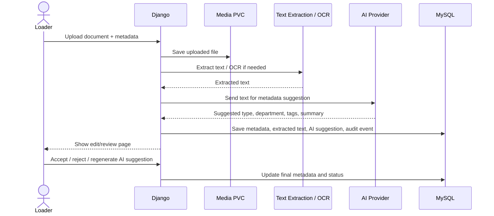
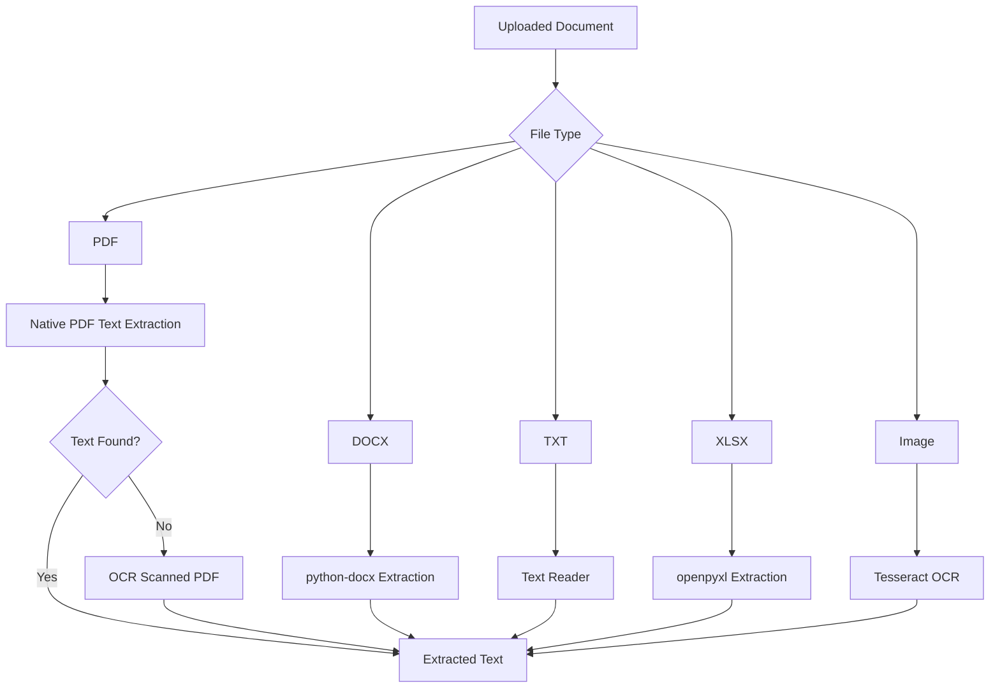
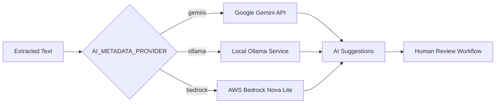
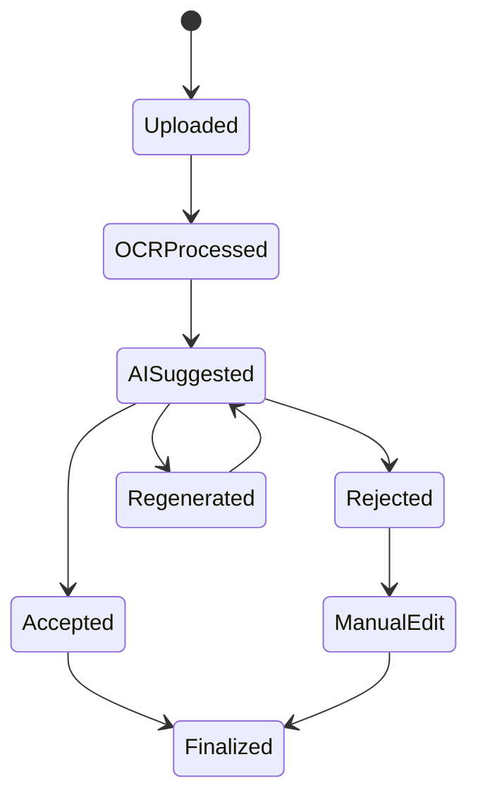

# AI Metadata Workflow

This document describes the OCR and AI-assisted metadata workflow used by the Intelligent Document Management Platform.

The platform combines OCR, document parsing, and AI-assisted metadata generation to help users organize and classify uploaded documents.

## AI Metadata Processing Flow

## OCR Processing Architecture

## AI Provider Selection

## AI Suggestion Lifecycle

## AI Metadata Fields

The application stores AI-generated metadata separately from official metadata.

| Field | Purpose |
| --- | --- |
| ai_document_type | Suggested document classification |
| ai_department | Suggested business department |
| ai_tags | Suggested tags |
| ai_summary | AI-generated document summary |
| ai_metadata_provider | Provider that generated the suggestion |
| ai_suggestion_status | Tracks review state |
| ai_suggested_at | Timestamp of generation |
| ai_error | Error information if generation fails |

## Human Review Design

The platform intentionally requires human review before AI metadata becomes official metadata.

Benefits:

- Prevents incorrect classification.
- Keeps users in control.
- Improves metadata quality.
- Supports auditability.
- Allows safe experimentation with local and external AI providers.

## AI Provider Options

| Provider | Advantage | Tradeoff |
| --- | --- | --- |
| Gemini | Better metadata quality and reasoning | Sends data externally |
| AWS Bedrock Nova Lite | AWS-managed model access through boto3 | Requires AWS credentials, permissions, and model access |
| Ollama | Local/private inference | Limited by local CPU and memory |

## Current AI Design Decisions

- Gemini is preferred when external API usage is acceptable.
- AWS Bedrock Nova Lite is available when AWS-managed inference is preferred.
- Ollama provides a local/private fallback.
- qwen2.5:0.5b is currently used because it fits within CRC resource constraints.
- AI suggestions are generated during upload when extracted text is available.
- AI suggestions remain separate from official metadata until accepted.

## Future AI Enhancements

Planned future enhancements include:

- Background AI processing queues.
- Semantic search.
- Vector embeddings.
- RAG document question answering.
- Metadata confidence scoring.
- Duplicate document detection.
- AI-assisted workflow approvals.
- Document summarization.
- Entity extraction.
- Multilingual OCR enhancement.
