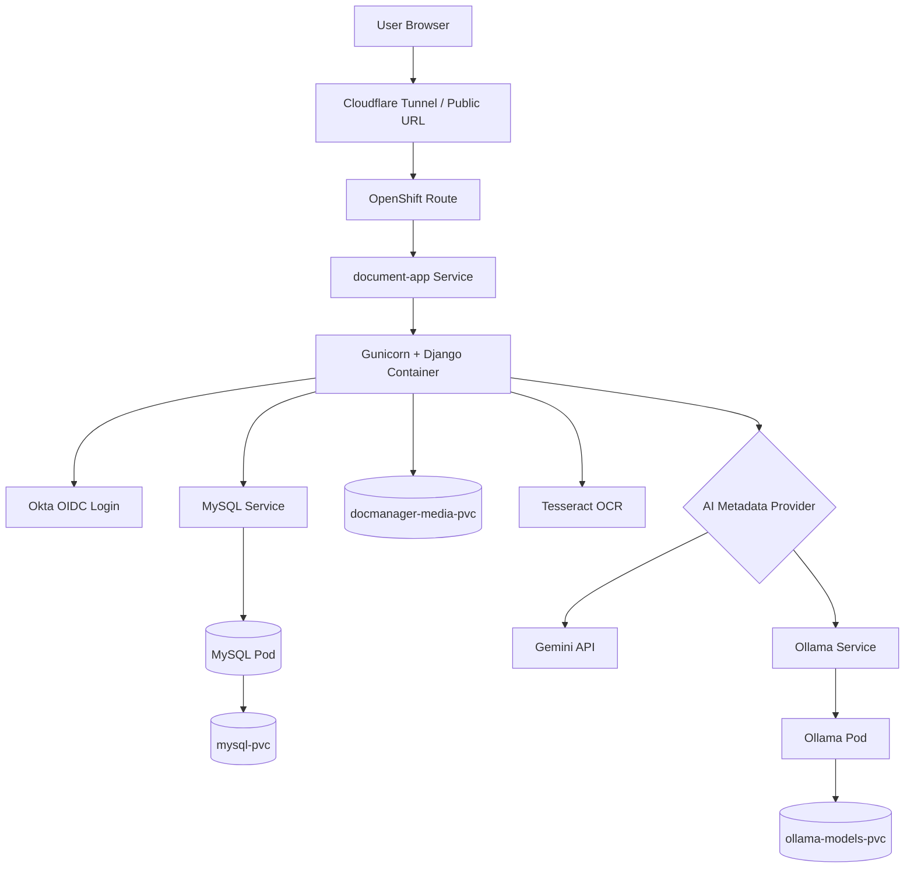
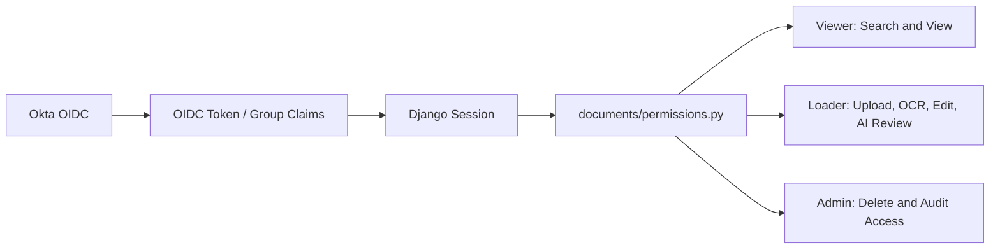
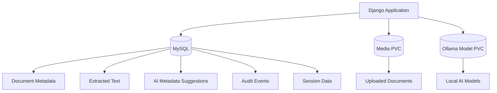

# Architecture

This document describes the current high-level architecture of the Intelligent Document Management Platform.

The platform is a Django-based document management and intelligent document processing application deployed on OpenShift CRC. It uses MySQL for metadata, persistent volume storage for uploaded files, Okta OIDC for authentication, Tesseract for OCR, and a switchable AI metadata provider using either Gemini or Ollama.

## Current OpenShift CRC Architecture

## Component Responsibilities

| Component | Responsibility |
| --- | --- |
| User Browser | Accesses the web application for upload, search, preview, edit, and review actions. |
| Cloudflare Tunnel | Provides public demo access to the OpenShift CRC route. |
| OpenShift Route | Routes external HTTP traffic to the document-app service. |
| document-app Service | Exposes the Django application pod inside OpenShift. |
| Django + Gunicorn | Hosts the application logic, templates, search, upload, OCR orchestration, AI metadata flow, and role-based access. |
| MySQL Service / Pod | Stores document metadata, extracted text, sessions, audit events, and AI suggestion status. |
| mysql-pvc | Persists MySQL database files. |
| docmanager-media-pvc | Persists uploaded document files. |
| Tesseract OCR | Extracts text from image files and scanned documents. |
| Gemini API | External AI metadata provider for higher-quality suggestions. |
| Ollama Service / Pod | Local AI metadata provider for private/offline model execution. |
| ollama-models-pvc | Persists downloaded Ollama models. |
| Okta OIDC | Handles authentication and provides group claims for application roles. |

## Role-Based Access Architecture

## Data Storage Architecture

## Design Notes

- Uploaded files are kept separate from metadata.
- Metadata, extracted text, AI suggestion status, and audit history are stored in MySQL.
- AI suggestions are staged separately from official metadata until accepted by a Loader or Admin user.
- Gemini is useful when external API processing is acceptable.
- Ollama is useful when local/private processing is preferred.
- The application is intentionally structured to support future enhancements such as semantic search, RAG, background jobs, document versioning, and workflow approvals.
