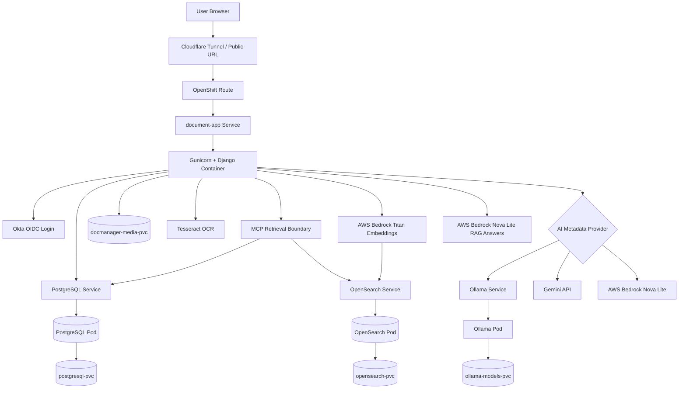
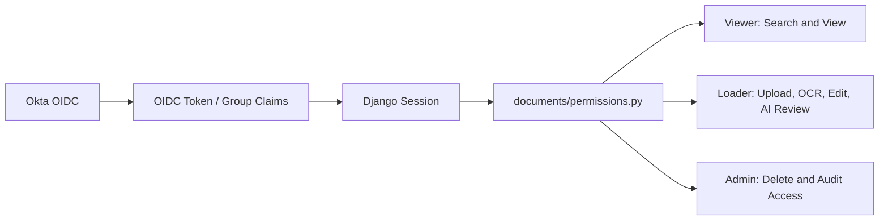
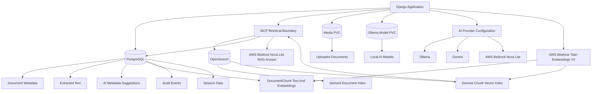

# Architecture

This document describes the current high-level architecture of the Intelligent Document Management Platform.

The platform is a Django-based document management and intelligent document processing application deployed on OpenShift CRC. It uses PostgreSQL for canonical document records, OpenSearch for derived search/vector/RAG retrieval, persistent volume storage for uploaded files, Okta OIDC for authentication, Tesseract for OCR, and switchable AI providers using Ollama, Gemini, or AWS Bedrock. Ask Documents retrieval runs through the backend MCP retrieval boundary defined in [MCP Document Retrieval Contract](mcp-retrieval-contract.md).

## Current OpenShift CRC Architecture

## Component Responsibilities

| Component | Responsibility |
| --- | --- |
| User Browser | Accesses the web application for upload, search, preview, edit, and review actions. |
| Cloudflare Tunnel | Provides public demo access to the OpenShift CRC route. |
| OpenShift Route | Routes external HTTP traffic to the document-app service. |
| document-app Service | Exposes the Django application pod inside OpenShift. |
| Django + Gunicorn | Hosts the application logic, templates, search, document Q&A, upload, OCR orchestration, AI metadata flow, and role-based access. |
| MCP Retrieval Boundary | Wraps Ask Documents retrieval, applies request validation, permission context handling, PostgreSQL hydration, and structured retrieval errors. |
| PostgreSQL Service / Pod | Stores canonical document metadata, extracted text, sessions, audit events, AI suggestion status, and chunk rebuild/debug data. |
| postgresql-pvc | Persists PostgreSQL database files. |
| OpenSearch Service / Pod | Stores derived document and chunk search records for keyword, vector, and RAG retrieval. |
| opensearch-pvc | Persists OpenSearch index data. |
| docmanager-media-pvc | Persists uploaded document files. |
| Tesseract OCR | Extracts text from image files and scanned documents. |
| Gemini API | External AI metadata provider for higher-quality suggestions. |
| AWS Bedrock Nova Lite | External AI metadata provider and RAG answer generator accessed through boto3 and AWS credentials. |
| AWS Bedrock Titan Embeddings V2 | External embedding provider for document chunks and AI Search queries. |
| Ollama Service / Pod | Local AI metadata provider for private/offline model execution. |
| ollama-models-pvc | Persists downloaded Ollama models. |
| Okta OIDC | Handles authentication and provides group claims for application roles. |

## Role-Based Access Architecture

## Data Storage Architecture

## Design Notes

- Uploaded files are kept separate from metadata.
- Metadata, extracted text, AI suggestion status, chunk rebuild/debug data, and audit history are stored in PostgreSQL.
- PostgreSQL `Document` records are the canonical source of truth for document metadata, lifecycle state, permissions, audit, and file locations.
- OpenSearch records are derived from PostgreSQL data and can be rebuilt with `python manage.py reindex_opensearch --create-indexes`.
- OpenSearch search hits are treated as candidate retrieval results only. Django hydrates final search results from PostgreSQL before rendering them to users.
- Ask Documents uses the MCP retrieval boundary for structured retrieval responses and error handling before prompt construction.
- Deleted or missing PostgreSQL documents are not shown even if stale OpenSearch records still exist.
- AI suggestions are staged separately from official metadata until accepted by a Loader or Admin user.
- Gemini is useful when external API processing is acceptable.
- AWS Bedrock Nova Lite is useful when AWS-managed model access is preferred and generates grounded Ask Documents answers after retrieval.
- Ollama is useful when local/private processing is preferred.
- The application is intentionally structured to support future enhancements such as hybrid retrieval, background jobs, document versioning, and workflow approvals.

## Source Of Truth Boundary

PostgreSQL owns all canonical document state. Upload, metadata edit, AI metadata accept/reject, delete, audit, and file access flows write or read PostgreSQL first. OpenSearch is updated afterward as a derived index. If OpenSearch is unavailable, the PostgreSQL document record remains valid and can be reindexed later.

The Django app is the only end-user UI. OpenSearch Dashboards is useful for operational inspection, but application users never act directly on OpenSearch records. Search and AI Search use OpenSearch for retrieval, then Django validates and hydrates results from PostgreSQL before displaying document metadata or file links. Ask Documents uses the MCP retrieval boundary over the same OpenSearch chunk index, hydrates citations from PostgreSQL, and only then builds the answer prompt.
