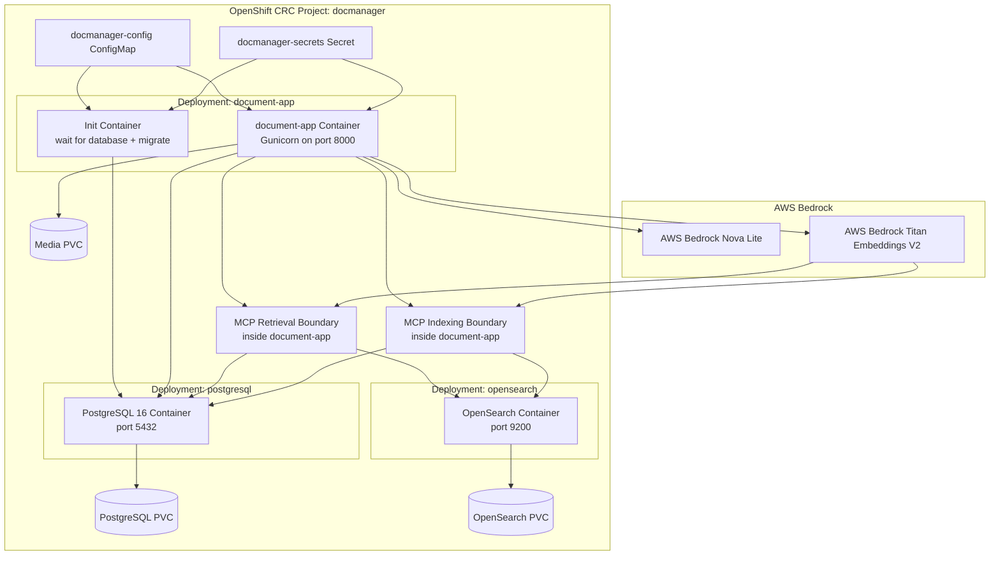
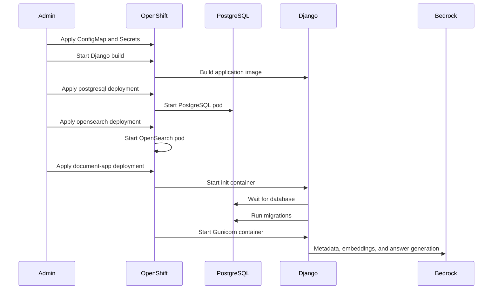
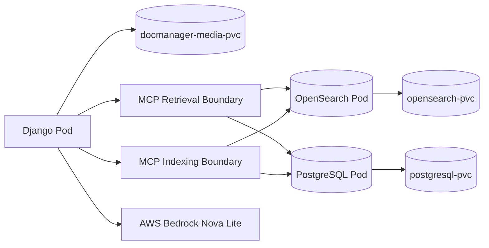

# Deployment Guide

This document describes the deployment architecture and operational model for the Intelligent Document Management Platform.

The application is currently designed and tested primarily on OpenShift CRC running on a local workstation environment.

## Deployment Architecture



## Deployment Components

| Component | Purpose |
| --- | --- |
| ConfigMap | Stores non-secret runtime configuration. |
| Secret | Stores database credentials, Okta secrets, AWS credentials, and sensitive values. |
| Init Container | Waits for the configured database and runs Django migrations before startup. |
| document-app | Main Django application container running under Gunicorn. |
| MCP Retrieval Boundary | Backend retrieval wrapper used by Ask Documents before Nova Lite answer generation. |
| MCP Indexing Boundary | Backend indexing wrapper used by upload/reprocess and bulk import when `MCP_INDEXING_ENABLED=True`. |
| PostgreSQL | Active persistent relational database service. |
| OpenSearch | Derived document/chunk retrieval index for keyword and vector search. |
| AWS Bedrock Nova Lite | AI metadata provider and Ask Documents answer generator through boto3. |
| AWS Bedrock Titan Embeddings V2 | Embedding provider for document chunks, AI Search, and Ask Documents retrieval. |
| Media PVC | Persistent storage for uploaded files. |
| PostgreSQL PVC | Active persistent database storage. |
| OpenSearch PVC | Persistent OpenSearch index storage. |

## Deployment Flow



## AWS Bedrock And MCP Configuration

Configure non-secret Bedrock and MCP settings in the OpenShift ConfigMap or EC2
environment:

| Variable | Example | Purpose |
| --- | --- | --- |
| AI_METADATA_PROVIDER | bedrock | Uses AWS Bedrock Nova Lite for metadata suggestions. |
| AWS_REGION | us-east-1 | AWS region for Bedrock runtime calls. |
| BEDROCK_NOVA_MODEL_ID | amazon.nova-lite-v1:0 | Nova Lite model used for metadata suggestions. |
| BEDROCK_EMBED_MODEL_ID | amazon.titan-embed-text-v2:0 | Titan model used for embeddings. |
| AI_EMBEDDING_MAX_CHARS | 2500 | Maximum text characters per embedding chunk. |
| AI_SEARCH_TOP_K | 5 | Number of semantic search results to return. |
| AI_RAG_TOP_K | 5 | Number of retrieved chunks to include as Q&A context. |
| AI_RAG_MAX_CONTEXT_CHARS | 1800 | Maximum characters included from each retrieved chunk. |
| AI_RAG_MAX_ANSWER_TOKENS | 700 | Maximum answer tokens requested from Bedrock Nova Lite. |
| AI_RAG_MIN_CONTEXT_CHARS | 80 | Minimum combined retrieved context required before answer generation. |
| AI_RAG_MIN_RETRIEVAL_SCORE | 0 | Optional OpenSearch score floor for retrieved RAG chunks. |
| MCP_RETRIEVAL_ENABLED | True | Routes Ask Documents retrieval through the MCP boundary. |
| MCP_RETRIEVAL_FALLBACK_ENABLED | False | Disables direct retrieval fallback during MCP validation so failures are visible. |
| MCP_INDEXING_ENABLED | True | Routes upload/reprocess and bulk import indexing through the MCP indexing boundary. |

Do not hardcode AWS credentials in application code. Use normal AWS credential
sources such as environment variables, OpenShift secrets, EC2 instance profiles,
or other supported boto3 credential providers.

## PostgreSQL and OpenSearch Migration Path

PostgreSQL no longer requires the `vector` extension. New deployments use the
standard `postgres:16` image, and OpenSearch is the semantic/vector retrieval
tier. PostgreSQL keeps canonical document metadata, lifecycle state, audit
events, sessions, file references, chunk text, and JSON embedding data that can
be used to rebuild OpenSearch indexes.

For an existing environment that previously used the pgvector image:

1. Apply the updated ConfigMap and PostgreSQL deployment.
2. Roll out PostgreSQL on the standard `postgres:16` image.
3. Run `python manage.py migrate`; migration `0011` drops the old HNSW index and
   `embedding_vector` column if they exist.
4. Run `python manage.py reindex_opensearch --create-indexes` when OpenSearch
   needs to be rebuilt from PostgreSQL metadata and retained JSON embeddings.

The old PostgreSQL `vector` extension may remain installed in existing
databases, but the application no longer imports pgvector or depends on that
extension for startup, migrations, indexing, or search.

Minimum AWS IAM permissions for Bedrock use:

```json
{
  "Effect": "Allow",
  "Action": [
    "bedrock:InvokeModel",
    "bedrock:Converse"
  ],
  "Resource": "*"
}
```

`bedrock:InvokeModel` is required for Titan embeddings and direct model calls.
`bedrock:Converse` is only required if the application or future provider code
uses the Bedrock Converse API.

Validate AWS access from PowerShell before enabling Bedrock:

```powershell
aws sts get-caller-identity
aws bedrock list-foundation-models --region us-east-1
```

Validate embeddings from the deployed app:

```powershell
oc exec deployment/document-app -- python manage.py rebuild_embeddings --limit 5
```

Successful output should show documents processed with chunks created. Errors
are printed per document and do not stop the entire batch.

## Database Backend

The current application image supports PostgreSQL only. `DB_ENGINE` should be
set to `postgresql`, and the OpenShift deployment uses the standard
`postgres:16` image:

```text
DB_ENGINE=postgresql
DB_NAME=document_management
DB_USER=docuser
DB_PASSWORD=<database-password>
DB_HOST=postgresql
DB_PORT=5432
```

For OpenShift, keep non-secret values in the ConfigMap and credentials in the
Secret. Set the password through the existing secret key used by Django:

```text
DB_PASSWORD
```

After changing database backend settings, restart the app and run migrations:

```powershell
oc rollout restart deployment/document-app
oc rollout status deployment/document-app
oc exec deployment/document-app -- python manage.py migrate
oc exec deployment/document-app -- python manage.py check
```

Other database engines are not part of the supported runtime architecture.

## Persistent Storage Design



## Operational Notes

- Do not delete PVCs unless intentionally resetting data.
- Restart the Django deployment after ConfigMap changes.
- Rebuild the image after Python or template updates.
- Use OpenShift rollout status commands to validate deployments.
- Cloudflare Tunnel exposes the internal OpenShift route externally for demo access.

## MCP Indexing Rollout

The MCP indexing contract is documented in
[`mcp-indexing-contract.md`](mcp-indexing-contract.md). The application now has
an in-process MCP indexing wrapper and a feature flag for browser and bulk
import rollout.

Roll out in this order:

1. Build and deploy an image that includes `documents.mcp_indexing`.
2. Set `MCP_INDEXING_ENABLED=True` in the ConfigMap.
3. Upload or reprocess one known document and confirm logs include
   `mcp_indexing status=ok`.
4. For a clean-room test, bulk import a known folder with
   `bulk_import_documents --rebuild-embeddings --reindex-opensearch`; with
   `MCP_INDEXING_ENABLED=True`, the command uses the MCP indexing boundary.
5. Validate Search, AI Search, and Ask Documents against those documents.
6. Keep the existing direct rebuild and reindex commands available as rollback
   tools until MCP indexing has parity.

## Initial Bulk Upload Validation

Use this flow after a brand new deployment or clean-room reset to prove the
write and read paths are healthy.

1. Confirm runtime settings and Bedrock embeddings from the app pod:

   ```powershell
   oc exec deployment/document-app -c document-app -- printenv MCP_INDEXING_ENABLED
   oc exec deployment/document-app -c document-app -- python manage.py shell -c "from documents.embeddings import get_titan_embedding; print(len(get_titan_embedding('hello world')))"
   ```

   Expected values are `True` and `1024`.

2. Copy test documents into `/tmp` on the running pod:

   ```powershell
   $pod = oc get pod -l app=document-app -o jsonpath="{.items[0].metadata.name}"
   oc cp .\test_documents\pdf $pod`:/tmp/bulk-docs -c document-app
   oc exec $pod -c document-app -- ls -la /tmp/bulk-docs
   ```

3. Run MCP-backed bulk import:

   ```powershell
   oc exec $pod -c document-app -- python manage.py bulk_import_documents /tmp/bulk-docs --limit 5 --rebuild-embeddings --reindex-opensearch --create-indexes 2>&1 | Select-String "mcp_indexing|chunks embedded|chunks indexed|Done"
   ```

   Expected output includes `mcp_indexing status=ok`, `chunks_created`,
   `chunk_records_indexed`, and `failed=0`.

4. Confirm persisted records:

   ```powershell
   oc exec $pod -c document-app -- python manage.py shell -c "from documents.models import Document, DocumentChunk; print('documents', Document.objects.count()); print('chunks', DocumentChunk.objects.count())"
   ```

5. Validate from the browser:

   ```text
   Search finds imported documents.
   AI Search returns semantic matches.
   Ask Documents returns an answer with citations.
   Citation links open the source documents.
   ```

6. Confirm Ask used MCP retrieval:

   ```powershell
   oc logs deployment/document-app -c document-app --tail=300 | Select-String "mcp_retrieval|rag_mcp"
   ```

   Expected output includes `mcp_retrieval status=ok` and `rag_mcp status=ok`.

## Future Deployment Enhancements

Planned future improvements include:

- Production Kubernetes/OpenShift deployment.
- Horizontal scaling.
- Ingress controller with TLS termination.
- Asynchronous OCR and AI processing.
- External object storage.
- Background bulk import and indexing workflows.
- Hybrid keyword/vector retrieval refinements on OpenSearch.
- CI/CD pipeline integration.
- Automated image builds.
- Centralized logging and monitoring.
