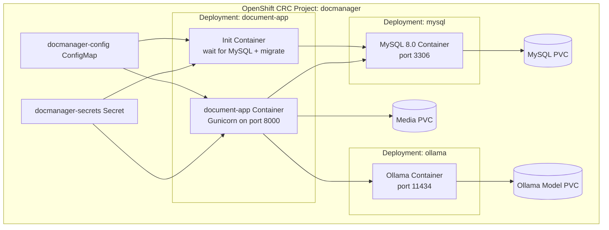
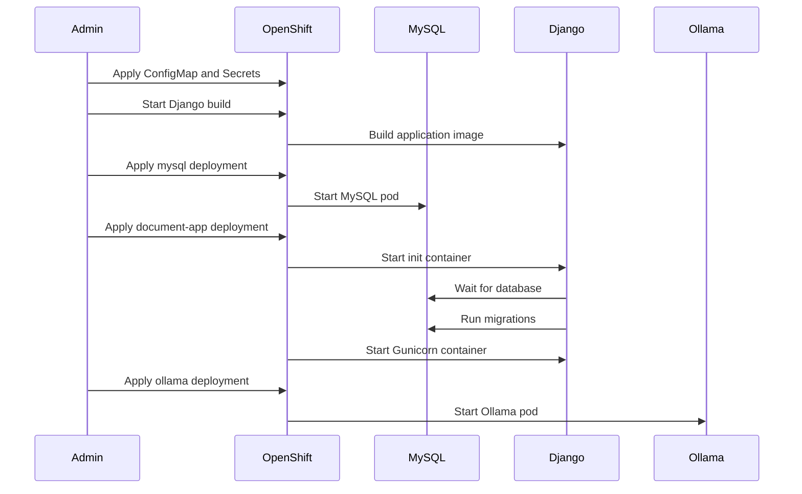
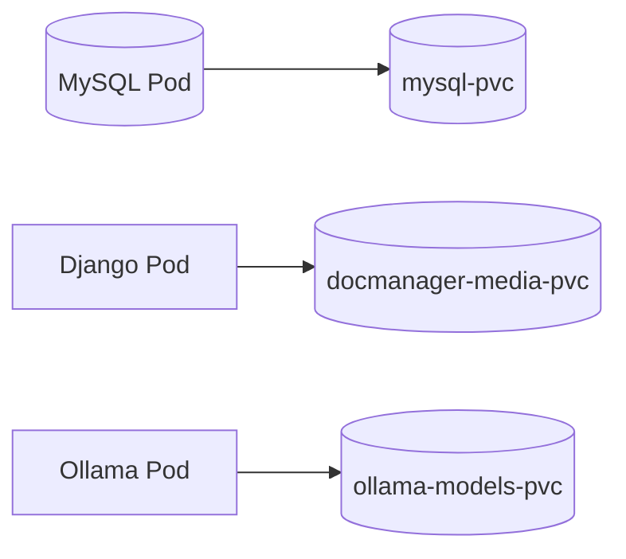

# Deployment Guide

This document describes the deployment architecture and operational model for the Intelligent Document Management Platform.

The application is currently designed and tested primarily on OpenShift CRC running on a local workstation environment.

## Deployment Architecture

## Deployment Components

| Component | Purpose |
| --- | --- |
| ConfigMap | Stores non-secret runtime configuration. |
| Secret | Stores database credentials, Okta secrets, Gemini API keys, and sensitive values. |
| Init Container | Waits for MySQL availability and runs Django migrations before startup. |
| document-app | Main Django application container running under Gunicorn. |
| mysql | Persistent relational database service. |
| ollama | Optional local AI inference service. |
| Media PVC | Persistent storage for uploaded files. |
| MySQL PVC | Persistent database storage. |
| Ollama Model PVC | Persistent AI model storage. |

## Deployment Flow

## Persistent Storage Design

## Operational Notes

- Do not delete PVCs unless intentionally resetting data.
- Restart the Django deployment after ConfigMap changes.
- Rebuild the image after Python or template updates.
- Recreate the Ollama model pull job after changing the configured model.
- Use OpenShift rollout status commands to validate deployments.
- Cloudflare Tunnel exposes the internal OpenShift route externally for demo access.

## Future Deployment Enhancements

Planned future improvements include:

- Production Kubernetes/OpenShift deployment.
- Horizontal scaling.
- Ingress controller with TLS termination.
- Asynchronous OCR and AI processing.
- External object storage.
- PostgreSQL with pgvector.
- CI/CD pipeline integration.
- Automated image builds.
- Centralized logging and monitoring.
