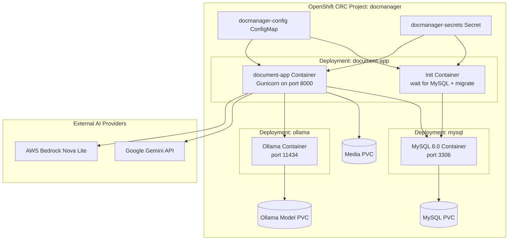
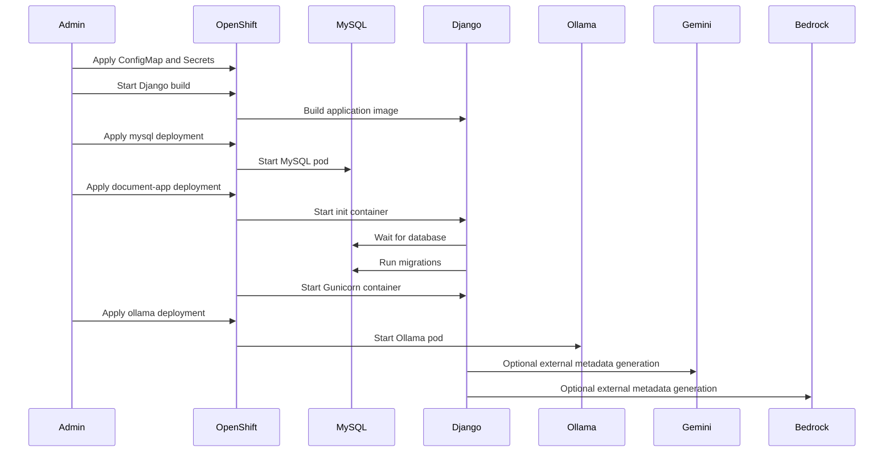
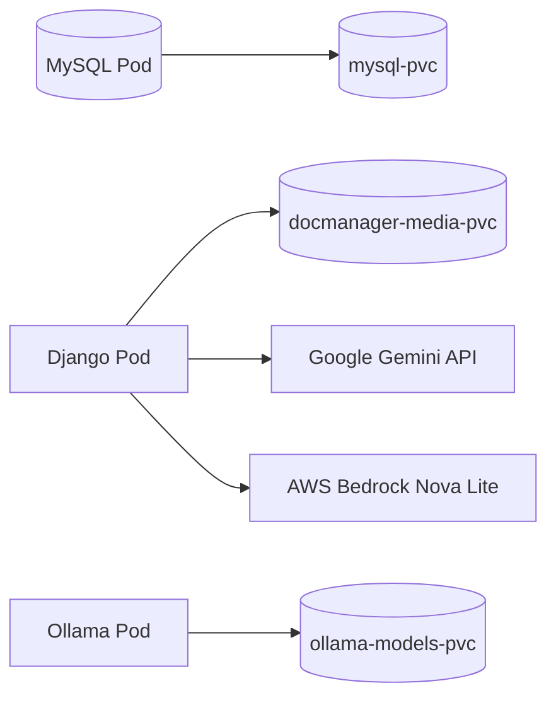

# Deployment Guide

This document describes the deployment architecture and operational model for the Intelligent Document Management Platform.

The application is currently designed and tested primarily on OpenShift CRC running on a local workstation environment.

## Deployment Architecture



## Deployment Components

| Component | Purpose |
| --- | --- |
| ConfigMap | Stores non-secret runtime configuration. |
| Secret | Stores database credentials, Okta secrets, Gemini API keys, AWS credentials, and sensitive values. |
| Init Container | Waits for MySQL availability and runs Django migrations before startup. |
| document-app | Main Django application container running under Gunicorn. |
| mysql | Default persistent relational database service. |
| PostgreSQL | Optional relational database backend selected by environment. |
| ollama | Optional local AI inference service. |
| Gemini API | Optional external AI metadata provider. |
| AWS Bedrock Nova Lite | Optional external AI metadata provider through boto3. |
| AWS Bedrock Titan Embeddings V2 | Optional embedding provider for semantic AI search. |
| Media PVC | Persistent storage for uploaded files. |
| MySQL PVC | Persistent database storage. |
| Ollama Model PVC | Persistent AI model storage. |

## Deployment Flow



## AWS Bedrock Phase 3 Configuration

Bedrock Phase 3 adds AWS-managed metadata generation and embeddings. Configure
non-secret settings in the OpenShift ConfigMap or EC2 environment:

| Variable | Example | Purpose |
| --- | --- | --- |
| AI_METADATA_PROVIDER | bedrock | Uses AWS Bedrock Nova Lite for metadata suggestions. |
| AWS_REGION | us-east-1 | AWS region for Bedrock runtime calls. |
| BEDROCK_NOVA_MODEL_ID | amazon.nova-lite-v1:0 | Nova Lite model used for metadata suggestions. |
| BEDROCK_EMBED_MODEL_ID | amazon.titan-embed-text-v2:0 | Titan model used for embeddings. |
| AI_EMBEDDING_MAX_CHARS | 2500 | Maximum text characters per embedding chunk. |
| AI_SEARCH_TOP_K | 5 | Number of semantic search results to return. |

Do not hardcode AWS credentials in application code. Use normal AWS credential
sources such as environment variables, OpenShift secrets, EC2 instance profiles,
or other supported boto3 credential providers.

Minimum AWS IAM permissions for Bedrock use:

```json
{
  "Effect": "Allow",
  "Action": [
    "bedrock:InvokeModel",
    "bedrock:Converse"
  ],
  "Resource": "*"
}
```

`bedrock:InvokeModel` is required for Titan embeddings and direct model calls.
`bedrock:Converse` is only required if the application or future provider code
uses the Bedrock Converse API.

Validate AWS access from PowerShell before enabling Bedrock:

```powershell
aws sts get-caller-identity
aws bedrock list-foundation-models --region us-east-1
```

Validate embeddings from the deployed app:

```powershell
oc exec deployment/document-app -- python manage.py rebuild_embeddings --limit 5
```

Successful output should show documents processed with chunks created. Errors
are printed per document and do not stop the entire batch.

## Database Backend Selection

The container can run against either MySQL or PostgreSQL. The active backend is
selected with `DB_ENGINE`.

MySQL remains the default so existing OpenShift deployments continue to work
without changes:

```text
DB_ENGINE=mysql
DB_NAME=document_management
DB_USER=docuser
DB_PASSWORD=<database-password>
DB_HOST=mysql
DB_PORT=3306
```

To run against PostgreSQL, provide PostgreSQL-friendly environment variables:

```text
DB_ENGINE=postgresql
DB_NAME=document_management
DB_USER=docuser
DB_PASSWORD=<database-password>
DB_HOST=postgresql
DB_PORT=5432
```

For OpenShift, keep non-secret values in the ConfigMap and credentials in the
Secret. Example live switch for a PostgreSQL service named `postgresql`:

```powershell
oc set env deployment/document-app `
  DB_ENGINE=postgresql `
  DB_HOST=postgresql `
  DB_PORT=5432 `
  DB_NAME=document_management `
  DB_USER=docuser
```

Set the password through the existing secret key used by Django:

```text
DB_PASSWORD
```

After changing database backend settings, restart the app and run migrations:

```powershell
oc rollout restart deployment/document-app
oc rollout status deployment/document-app
oc exec deployment/document-app -- python manage.py migrate
oc exec deployment/document-app -- python manage.py check
```

The Django models are unchanged. The same migrations are used for both MySQL
and PostgreSQL.

## Persistent Storage Design



## Operational Notes

- Do not delete PVCs unless intentionally resetting data.
- Restart the Django deployment after ConfigMap changes.
- Rebuild the image after Python or template updates.
- Recreate the Ollama model pull job after changing the configured model.
- Use OpenShift rollout status commands to validate deployments.
- Cloudflare Tunnel exposes the internal OpenShift route externally for demo access.

## Future Deployment Enhancements

Planned future improvements include:

- Production Kubernetes/OpenShift deployment.
- Horizontal scaling.
- Ingress controller with TLS termination.
- Asynchronous OCR and AI processing.
- External object storage.
- PostgreSQL with pgvector.
- CI/CD pipeline integration.
- Automated image builds.
- Centralized logging and monitoring.
